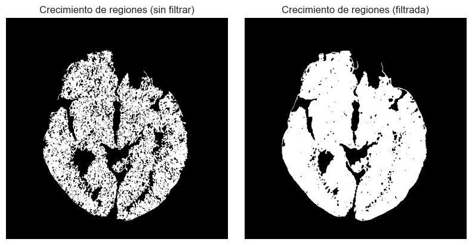
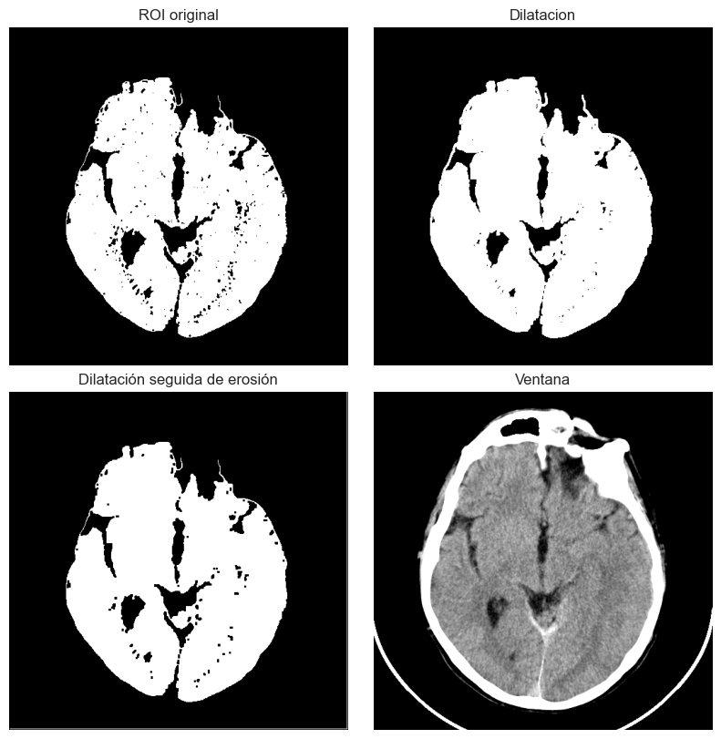
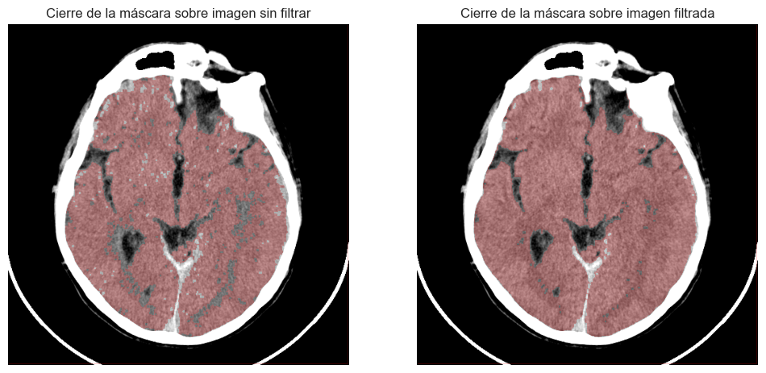
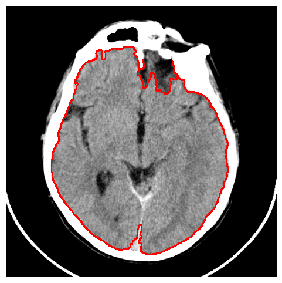

# 🧠 Segmentación de Imágenes Médicas II – Crecimiento de Regiones y Morfología

Este proyecto explora técnicas de segmentación avanzada aplicadas a una imagen médica (TC craneal), incluyendo crecimiento de regiones, filtrado morfológico y extracción de descriptores anatómicos.

## 🧾 Descripción del Proyecto

Se implementa una segmentación personalizada basada en el algoritmo de **crecimiento de regiones**, optimizada para el tejido cerebral. Se evalúan los resultados con filtrado espacial previo, se aplica cierre morfológico para refinar la máscara y se extraen descriptores clave como área, perímetro y compacidad.

## ⚙️ Tecnologías y Librerías

- `numpy`: operaciones sobre matrices y estadísticas.
- `matplotlib`: visualización.
- `pydicom`: lectura de imágenes médicas DICOM.
- `cv2` (OpenCV): contornos, descriptores y filtrado morfológico.

## 📸 Procesamiento Realizado

### 1. Crecimiento de regiones

Se aplica segmentación basada en homogeneidad a partir de una **semilla en el tejido cerebral**. Se prueba con:

- Imagen sin filtrar (umbral = 22)
- Imagen filtrada con Gaussiano (umbral = 2)

📌 El resultado en la imagen filtrada es más preciso y menos ruidoso.

### 2. Filtrado morfológico – Cierre

Para limpiar la máscara resultante se aplica un **cierre morfológico** (dilatación seguida de erosión) con un elemento estructurante 3x3. El objetivo es:

- Rellenar huecos internos
- Suavizar bordes
- Eliminar ruido pequeño

📌 El cierre sobre la máscara filtrada fue el más eficaz.

### 3. Cálculo de descriptores

A partir de la región segmentada final se calculan:

- **Perímetro:** 1625.4 px
- **Área:** 91880 px²
- **Compacidad:** 28.8
- **Circularidad:** 0.4
- **Media de intensidad:** 141.6
- **Desviación estándar:** 23.2
- **Moda:** 132

📌 Estos valores cuantifican propiedades de la zona anatómica segmentada.

## ✅ Conclusión

El crecimiento de regiones, combinado con filtrado previo y operaciones morfológicas, permite obtener una máscara limpia y precisa del tejido de interés. El cálculo de descriptores es una herramienta poderosa para analizar cuantitativamente regiones segmentadas.
